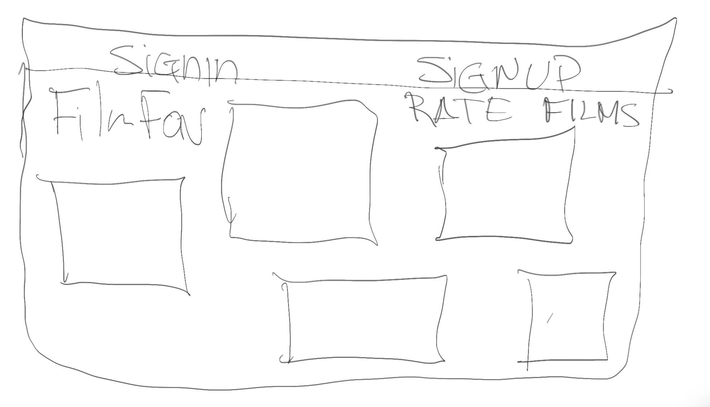
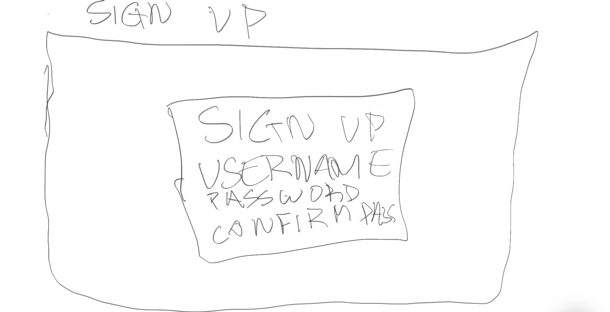
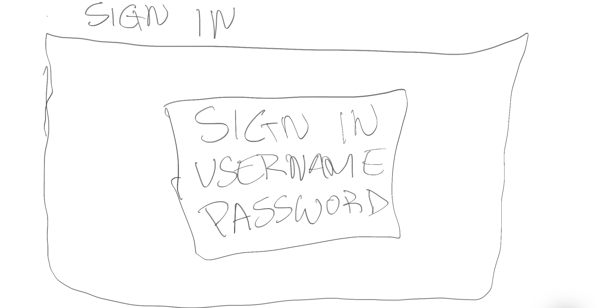
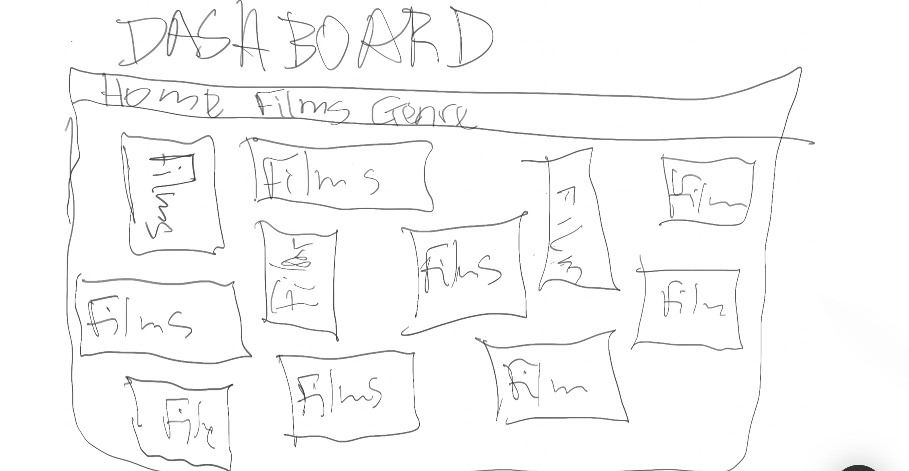
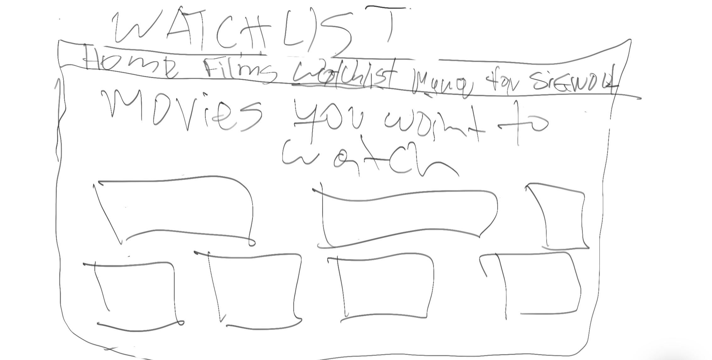
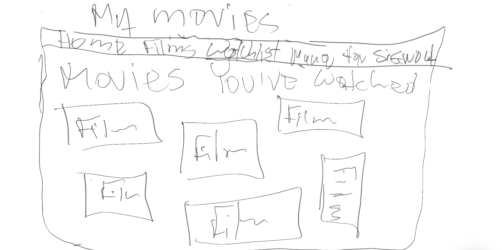
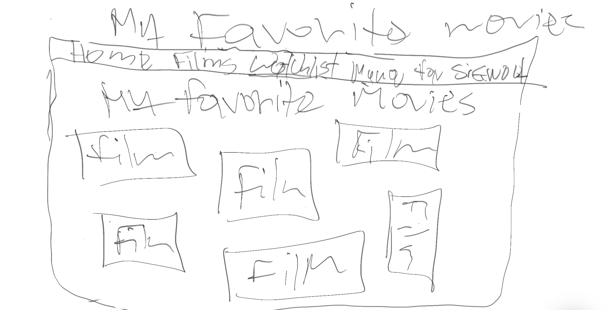
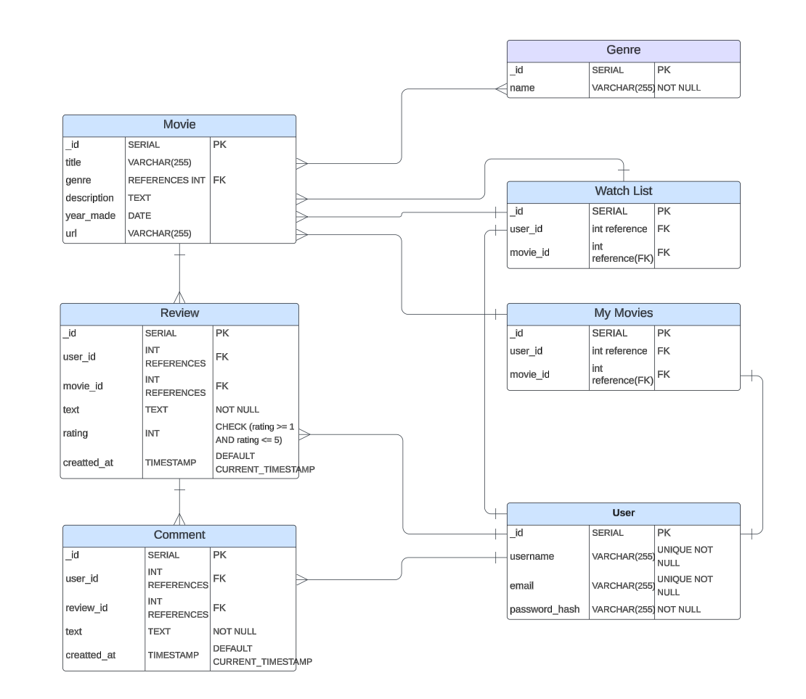

# FilmFav: Social Cinema Review

## Overview
FilmFav is a streamlined movie rating app that helps users discover great films through trusted opinions. By combining personalized ratings with social features, FilmFav creates an engaging platform where movie lovers can share their views and find their next favorite film.
Key Features:

### Smart Rating System
Rate films with both quick scores and optional mini-reviews, plus mood tags for better recommendations
Personal Watchlist: Keep track of films to watch and organize your viewing history
Quick Find: Easy search with filters for genres, release dates.

### Value Proposition
FilmFav makes it simple to rate movies you've watched and find great recommendations from people whose opinions you trust. Whether you're a casual viewer or film buff, FilmFav helps you discover movies you'll love while connecting with others who share your cinematic interests.

### MVP
- AAU, I want to be able to sign up for account with a username and password.
- AAU, I want to be able to view movies and leave a review.
- AAU,  I would like to see other users reviews and comment on their review.

### Stretch Goals
- AAU, I want to be able to add a favorite to my favorites, prospective movie to my watchlist, and a movies I’ve seen to my movies.
- AAU, I want to be able to see the highest and lowest rated movies on my dashboard.
- AAU, I want to access a preview of the films
- Use API instead of manually inputting the films

# WireFrame

## Landing Page

## Sign Up

## Sign In

## Dashboard

## WatchList

## My Movies

## Favorite Movies

## ERD Diagram

## Components Diagram
.png>)

# Routes

### Sign-up

| Action  | Route       | HTTP Verb |
|---------|-------------|-----------|
| Create  | `/user/sign-up`  | POST      |

### Sign-in

| Action  | Route           | HTTP Verb |
|---------|-----------------|-----------|
| Create  | `/user/sign-in` | POST      |
### My Reviews

| Action | Route               | HTTP Verb |
|--------|---------------------|-----------|
| Index  | `/user/myreviews`   | GET       |

---

---

### My Watchlist

| Action | Route               | HTTP Verb |
|--------|---------------------|-----------|
| Index  | `/user/mywatchlist`   | POST       |
| Index  | `/user/mywatchlist/:movie_id`   | Delete     |

---

### My Movies

| Action | Route               | HTTP Verb |
|--------|---------------------|-----------|
| Index  | `/user/mymovies`    | POST       |
| Index  | `/user/mymovies/:movie_id`    | Delete     |

---

### Movies

| Action  | Route                   | HTTP Verb |
|---------|-------------------------|-----------|
| Index   | `/movies`               | GET       |
| Show    | `/movies/:movieId`      | GET       |

---

### Reviews

| Action  | Route                                | HTTP Verb |
|---------|--------------------------------------|-----------|
| Create  | `/movies/:movieId/reviews`          | POST       |
| Get     | `/movies/:movieId/reviews/:reviewId`| GET        |
|Edit     | `/movies/:moviesId/reviews/:reviewId/edit` | PUT |
| Delete  | `/movies/:movieId/reviews/:reviewId`| DELETE     |

---

### Comments

| Action  | Route                                        | HTTP Verb |
|---------|---------------------------------------------|-----------|
| Create  | `/movies/:movieId/reviews/:reviewId/comments`         | POST      |
| Delete  | `/movies/:movieId/reviews/:reviewId/comments/:commentId` | DELETE    |

# Project Timeline

| Day       | Task                                                | Description                                  |
|-----------|----------------------------------------------------|----------------------------------------------|
| Friday    | Submit and Get Proposal Approved                  | Submit detailed proposal with ERD, wireframes, and user stories. Get approval, set up Git repository, and initialize the project structure. |
| Saturday  | Work on Backend                                   | Set up Express server, MongoDB connection, user authentication routes, JWT tokens, and create a basic user model. |
| Sunday    | Backend Development                               | Create Movie and Review models and routes, set up comments functionality, and test API endpoints with Postman. |
| Monday    | Iterative Improvement and Testing                 | Refine existing features, run integration tests, and address any feedback from previous work. Prepare for deployment tasks. |
| Tuesday   | Presentation Day                                  | Showcase the app's progress, demo key features, and gather feedback for final improvements. |
| Wednesday | Backend Deployment                                | Deploy backend to Heroku (or similar) for early integration testing and feedback. |
| Thursday  | Frontend Deployment                               | Deploy frontend to Netlify (or similar) for user testing as the app continues to be built. |
| Friday    | Core Movie Features                              | Build movie listing page, create individual movie view, implement search and filtering functionality, and add movie details display. |
| Saturday  | User Features                                    | Build user profile sections (MyMovies, MyReviews, MyFavorites), implement watchlist functionality, create a review submission form, and add a commenting system. |
| Sunday    | UI/UX Enhancement                                | Style components with CSS, add responsive design, implement loading states, and improve error handling and user feedback. |
| Monday    | Testing & Bug Fixes                              | Perform comprehensive feature testing, cross-browser testing, mobile responsiveness testing, and fix identified bugs. |
